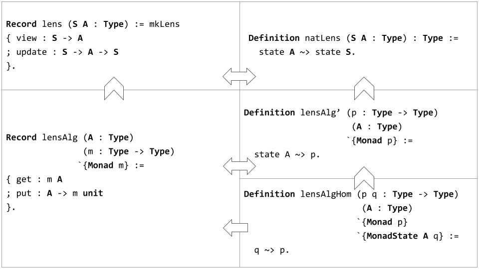

# Towards Optic-Based Algebraic Theories

This repository contains the supplementary material associated to the article *[Towards Optic-Based Algebraic Theories: the Case of Lenses](towards.pdf)* (J. López-González and Juan M. Serrano), submitted to *Trends in Functional Programming 2018*. In essence, it contains Coq definitions and theories revolving around very well-behaved *lenses* and *MonadState*. They are summarized in the following figure.

Broadly, we show that:
1. MonadState generalizes lens. Particularly, `MonadState A (state S)` is isomorphic to `lens S A`. Given this situation, we will refer to MonadState as *lens algebra* (`lensAlg`).
2. A monad morphism `state A ~> state S` is isomorphic to `lens S A`.
3. We can abstract away `state S` from the aforementioned monad morphism, obtaining `lensAlg'` as a result. In other words, `natLens S A` is exactly `lensAlg' (state S) A`.
4. `lensAlg` is isomorphic to `lensAlg'`, and hence MonadState.
5. We can also abstract away `state A` from `lensAlg'`, obtaining `lensAlgHom`. In other words, `lensAlg' p A` is exactly `lensAlgHom p (state A) A`.
6. `lensAlgHom p q A` induces a lawful `lensAlg A p`.
