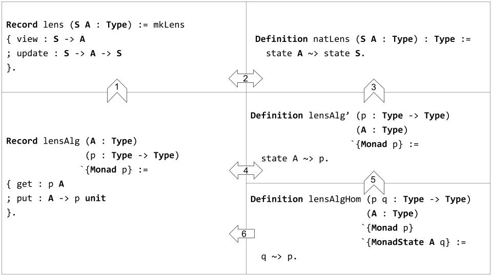

# Lens Algebra

This repository contains Coq definitions and theorems revolving around very well-behaved *lenses* and *MonadState*. They are summarized in the following table.

Broadly, we show that:
* MonadState generalizes lens. Particularly, `MonadState A (state S)` is isomorphic to `lens S A`. Given this situation, we will refer to MonadState as *lens algebra* (`lensAlg`).
* A monad morphism `state A ~> state S` is isomorphic to `lens S A`.
* We can abstract away `state S` from the aforementioned monad morphism, obtaining `lensAlg'` as a result. In other words, `natLens S A` is exactly `lensAlg' (state S) A`.
* `lensAlg` is isomorphic to `lensAlg'`, and hence MonadState.
* We can also abstract away `state A` from `lensAlg'`, obtaining `lensAlgHom`. In other words, `lensAlg' p A` is exactly `lensAlgHom p (state A) A`.
* `lensAlgHom p q A` induces a lawful `lensAlg A p`.
